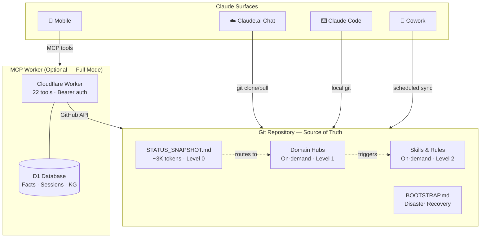

# Memex — Persistent Memory for Claude

[](LICENSE)
[](config/mcp-worker/)
[](QUICKSTART.md)
[](#architecture)

Claude forgets everything between conversations. Built-in memory is auto-generated,
unstructured, and lags by days. Memex gives you **structured, cross-surface memory
that you control** — using a private GitHub repo as the single source of truth.

## 🚀 Get started — paste this into Claude

Open [Claude Code](https://claude.ai/code) (recommended — it runs the install commands for you) or [claude.ai](https://claude.ai) and paste:

> Help me set up Memex from scratch. Read https://github.com/a-pap/memex/blob/main/START_HERE.md and walk me through it step-by-step. I'm starting with nothing.

Claude will guide you through: forking this repo, generating a GitHub token, creating a free Cloudflare account (OAuth via GitHub, no card), deploying the MCP worker, and connecting it to Claude.ai. Total time: ~15 minutes.

**Requirements:**
- GitHub account (free)
- Claude account — Pro/Max/Team/Enterprise for Claude Code (recommended path). Free claude.ai works for Lite mode (copy/paste commands yourself).
- Cloudflare account for Full mode (free tier is enough, sign up with GitHub OAuth, no card). Skip for Lite.

**Don't have Claude Code?** Install: `curl -fsSL https://claude.ai/install.sh | bash` on macOS/Linux/WSL, or `brew install --cask claude-code` on macOS. [Full install docs](https://code.claude.com/docs/en/setup).

**Want the ultra-light version (no Cloudflare, just a git repo)?** Start with [QUICKSTART.md](QUICKSTART.md) — 10 minutes.

## How is this different?

There are dozens of `claude-memory` projects on GitHub. Almost all are SQLite-based MCP servers for Claude Code. Memex takes a fundamentally different approach:

| | **Memex** | **Typical memory MCP** |
|---|---|---|
| Works in | Chat, Code, Mobile, Cowork | Claude Code only |
| Storage | Git (versioned, auditable, human-readable) | SQLite (local, opaque) |
| Structure | Domain hubs, routing table, skills | Flat key-value or embeddings |
| Recovery | Full restore from repo alone | DB backup needed |
| Token cost | ~3K startup, on-demand loading | Dumps everything into context |
| Cross-surface | Same repo, any device | Requires DB sync |

## What it looks like

<details>
<summary><strong>Status check — one prompt, full context</strong></summary>

You say "status check" — Claude reads `STATUS_SNAPSHOT.md` (~3K tokens) and responds:

```
Here's where things stand:

WORK: Auto-placement beta showing +27% revenue uplift. Mike leaving Apr 25 —
knowledge transfer is the P0 blocker. Neural banners at 0.45% coverage,
design review with Tom on Friday.

HEALTH: Max's last urinalysis clean (Mar 15, pH 7.0, no crystals). Diet
transition to the new therapeutic formula starts next week. Brain MRI
referral pending — target June-August in Berlin.

SIDE PROJECT: SideProject deployment pipeline still blocked on Meta Business
Verification. No Sentry errors last 7 days. Lukas pinged about landing
page copy — respond by Thursday.

RELOCATION: Berlin apartment search active (budget €1,500/mo). Agent sent
3 options in Kreuzberg yesterday — review in Drive.
```

No re-explaining your life. No "can you remind me what you're working on?"
</details>

<details>
<summary><strong>Cross-surface continuity</strong></summary>

Morning — Claude.ai Chat on your phone:
> "Decided to delay overlay format to Q2, auto-placement is the priority."

Claude commits the decision to `hubs/work.md` and `STATUS_SNAPSHOT.md`.

Afternoon — Claude Code on your laptop:
> "What's the status on overlay?"

Claude reads the same repo:
> "You moved overlay to Q2 this morning — auto-placement is the current priority.
> Implementation kickoff is penciled for Apr 14."

No copy-paste. No "as we discussed." The repo is the shared brain.
</details>

<details>
<summary><strong>Disaster recovery — full restore in 2 minutes</strong></summary>

Worst case: all memory edits wiped, new Claude model, fresh conversation.

You paste the `BOOTSTRAP.md` prompt. Claude clones the repo, reads your
full context, re-creates memory edits, and confirms:

```
✓ Restored from repo.
  9 hubs loaded, 8 memory edits active, 3 connected tools detected.
  Last sync: 2 hours ago. No conflicts.
```

Everything the previous Claude instance knew — this one knows too.
</details>

## Two modes

| | **Lite** | **Full** |
|---|----------|----------|
| **What** | GitHub repo only | Repo + Cloudflare MCP Worker + D1 |
| **Setup time** | 10 min | 15 min |
| **Tools** | Git read/write via Claude | 22 MCP tools (wake_up, search, KG, session logs...) |
| **Best for** | Claude Code, simple workflows | Claude.ai chat, multi-surface, automated monitoring |
| **Guide** | [QUICKSTART.md](QUICKSTART.md) | [SETUP_MCP.md](SETUP_MCP.md) |

## What you get

- **Persistent context** that survives conversation resets and platform changes
- **Structured domain knowledge** organized in hub files
- **Cross-surface sync** — desktop, mobile, Code, Cowork all read the same repo
- **Disaster recovery** — full memory restoration from repo alone
- **Behavioral rules** that persist via memory edits
- **Custom skills** — repeatable procedures Claude can execute
- **Graduated context loading** — minimal tokens at startup, everything else on-demand
- **Quality loop** (Full mode) — automated health checks, session logging, TODO generation

## Architecture



**Graduated loading:** Claude reads `STATUS_SNAPSHOT` first (~3K tokens, covers 80% of questions). If the topic needs more depth, it loads a single hub (Level 1). Skills and multi-hub analysis (Level 2-3) are rare. Total startup cost: **~5K tokens** vs. 40K+ if you dump everything.

### File structure

```
Your Private Repo (source of truth)
├── STATUS_SNAPSHOT.md      # Cross-domain status (~50 lines, read first)
├── CLAUDE.md               # Routing table + key rules
├── BOOTSTRAP.md            # Disaster recovery — full restore from zero
├── RULES.md                # Behavioral patterns, failure modes
├── hubs/                   # Domain knowledge files (on-demand)
├── skills/                 # Repeatable procedures (on-demand)
├── config/                 # Projects, connectors, sync protocol
│   └── mcp-worker/         # Cloudflare Worker source (Full mode)
├── memory/                 # Memory edits + preferences snapshots
├── references/             # Deep research artifacts
└── archive/                # Chat history backups
```

See [ARCHITECTURE.md](ARCHITECTURE.md) for design rationale and token economics.

## How it works

1. Claude clones/pulls your private repo at conversation start
2. Reads `STATUS_SNAPSHOT.md` for quick routing (~3K tokens)
3. Loads specific hub files on-demand based on topic
4. Uses behavioral rules from `RULES.md` and memory edits
5. After significant changes, commits and pushes back to the repo
6. Next conversation (any surface) picks up where the last left off

In **Full mode**, Claude.ai connects to the MCP server directly — no git commands needed. The `wake_up` tool loads everything in one call.

## What it looks like

<details>
<summary><strong>Status check — structured response across all domains</strong></summary>

**Prompt:** "Status check"

**Claude's response** (using Memex):

> Here's your current status across all domains:
>
> **Critical path:**
> - Berlin relocation → early June 2026. Waiting on apartment options, visa summary pending.
> - Max (dog) — mobility restriction ended. Epilepsy monitoring: 2 seizures in 4 months, brain MRI needed.
>
> **Work (TechCorp) — Q2 started:**
> - Auto-placement: +25-30% revenue, exiting beta in Q2
> - Neural banners: multi-banner generation pipeline, target 10%+ coverage
>
> **Side project (SideProject):**
> - Stripe Connect live. Deploy pipeline broken — needs fix before launch.
>
> **Upcoming:**
> - Apr 15-19: Conference (vacation days 15-17)
> - Apr 20: Dental appointment
> - May: EU trip with partner + dogs

Without Memex, Claude would say: *"I don't have any information about your current projects or status."*

</details>

<details>
<summary><strong>Cross-surface continuity — Chat → Code, context preserved</strong></summary>

**Scenario:**
1. In **Claude Chat**, you discuss a project architecture decision
2. Claude commits the decision to `hubs/work.md` and marks it SETTLED in `STATUS_SNAPSHOT.md`
3. An hour later, you open **Claude Code** in the same repo
4. Claude reads `STATUS_SNAPSHOT` → sees the decision → doesn't re-ask

```
# In Claude Code:
You: "Implement the auth module we discussed"
Claude: "I see from the hub that you decided on JWT with refresh tokens
         (settled Apr 9). I'll implement that approach..."
```

No copy-pasting. No re-explaining. The repo IS the shared brain.

</details>

<details>
<summary><strong>Disaster recovery — full restore in 2 minutes</strong></summary>

**Scenario:** You clear all Claude memory edits (or start a fresh account).

**Recovery steps:**
1. Paste the `BOOTSTRAP.md` prompt into a new Claude conversation
2. Claude clones the repo, reads `STATUS_SNAPSHOT.md`, and restores all memory edits
3. Within 2 minutes — full context restored, as if nothing happened

This works because the **repo is the source of truth**, not Claude's memory. Memory edits are just behavioral shortcuts; all facts live in the repo.

</details>

## Quick start

1. **Fork this repo** as your private memory repo
2. **Follow [QUICKSTART.md](QUICKSTART.md)** (Lite) or [SETUP_MCP.md](SETUP_MCP.md) (Full)
3. **Customize** hub files, skills, and rules for your domains
4. Start a conversation — Claude will use your memory

Check the [examples/](examples/) directory for filled-in demos of every file type.

## MCP Tools (Full mode — 22 tools)

Core: `wake_up`, `get_snapshot`, `get_hub`, `get_rules`, `get_taxonomy`
Files: `list_files`, `read_file`, `search`, `search_in_hub`, `update_file`
D1 Facts: `store_fact`, `query_facts`
Sessions: `log_session`, `auto_log`, `recent_sessions`
Errors: `log_error`, `error_report`
Knowledge Graph: `kg_add`, `kg_query`
Quality: `health_check`, `todo_add`
Utility: `flush_cache`

See [config/mcp-worker/README.md](config/mcp-worker/README.md) for the full tool reference.

## Documentation

| Doc | Purpose |
|-----|---------|
| [QUICKSTART.md](QUICKSTART.md) | Lite mode setup (10 min, repo only) |
| [SETUP_MCP.md](SETUP_MCP.md) | Full mode setup (15 min, MCP + D1) |
| [ARCHITECTURE.md](ARCHITECTURE.md) | Design rationale, token economics |
| [ONBOARDING.md](ONBOARDING.md) | Automated setup wizard for Claude |
| [SKILL_CATALOG.md](SKILL_CATALOG.md) | Built-in and custom skill templates |
| [SECURITY.md](SECURITY.md) | Threat model, PAT guidelines, what not to store |
| [CONTRIBUTING.md](CONTRIBUTING.md) | How to propose changes |
| [CHANGELOG.md](CHANGELOG.md) | Project history (Oct 2025 → present) |

## License

MIT — use, modify, share freely.
