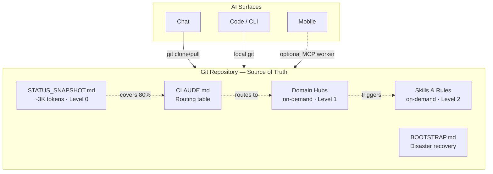

# Memex — Curated Memory for AI Agents

[](LICENSE)
[](GIT_AS_RAG.md)
[](QUICKSTART.md)
[](GIT_AS_RAG.md)

Claude forgets everything between conversations. Built-in memory is
auto-generated, opaque, and lags by days. Memex gives you **structured memory you
control** — a private git repository of plain-text markdown, retrieved by a curated
routing table and graduated loading. It is RAG without a vector database, and it
runs on nothing but a git repo and the model you already use.

> **The design, in one essay:** [**Git as RAG — curated retrieval as agent
> memory →**](GIT_AS_RAG.md). Why a curated repo beats an embedding store for
> *personal* memory, and where it doesn't.

## The idea

A person's memory is small, self-authored, constantly edited, and ranked by what
is **true now** — not by what is semantically similar. That is the opposite of the
large, static, foreign corpus a vector database is built for. So Memex retrieves by
**curation**, not by nearest-neighbor search:

- **A routing table** (`CLAUDE.md`) maps each topic to one file. The agent reads the
  table and knows exactly where the answer lives — no embeddings, no top-k, no false
  neighbor.
- **Graduated loading** stages retrieval by cost: a ~3K-token status snapshot
  (Level 0) answers most questions; a single domain *hub* (Level 1) is pulled only
  when needed; deeper reads are rare by design. A typical session spends a few
  thousand tokens of memory context, not forty thousand.
- **Write discipline** is the real work: one canonical home per fact, freshness
  decay, don't-store-the-derivable, distill-on-a-budget, and a periodic
  consolidation pass. Memory quality is a write-side property — see
  [ARCHITECTURE.md](ARCHITECTURE.md).

Because the store is a git repo, every change is a diff, every fact is one
reviewable edit, and the whole memory restores from a clone. It is portable across
models, surfaces, and vendors, because it is just text you own.

## How is this different?

There are dozens of `claude-memory` projects on GitHub — almost all are SQLite or
vector-store MCP servers for Claude Code. Memex takes a different approach.

| | **Memex** | **Typical memory tool** |
|---|---|---|
| Retrieval | Curated routing + graduated loading | Embeddings + nearest-neighbor |
| Storage | Git — versioned, diffable, human-readable | SQLite / vector index (opaque) |
| Structure | Domain hubs + routing table + skills | Flat key-value or chunked embeddings |
| Recency / authority | Native (the file's current state is the truth) | Bolted on via metadata, if at all |
| Recovery | Full restore from the repo alone | DB / index backup needed |
| Token cost | ~3K startup, on-demand loading | Often dumps everything into context |
| Portability | Any model, any surface, any vendor | Tied to the embedding model + DB |
| Dependencies | A git repo. That's it. | A database or vector store to operate |

The honest trade-offs — where embeddings win, and why mature setups run both — are
in [GIT_AS_RAG.md §7](GIT_AS_RAG.md).

## What it looks like

<details open>
<summary><strong>Status check — one prompt, full context</strong></summary>

You say "status check." Claude reads `STATUS_SNAPSHOT.md` (~3K tokens) and responds:

```
WORK: Auto-placement beta showing +27% revenue uplift. Mike leaving Apr 25 —
knowledge transfer is the P0 blocker. Neural banners at 0.45% coverage,
design review with Tom on Friday.

HEALTH: Max's last urinalysis clean (Mar 15, pH 7.0, no crystals). Diet
transition to the new therapeutic formula starts next week.

SIDE PROJECT: deployment pipeline still blocked on Meta Business Verification.
No Sentry errors last 7 days. Lukas pinged about landing-page copy — respond
by Thursday.

RELOCATION: Berlin apartment search active (budget EUR 1,500/mo). Agent sent
3 options in Kreuzberg yesterday — review in Drive.
```

No re-explaining your life. No "can you remind me what you're working on?"
</details>

<details>
<summary><strong>Cross-surface continuity — Chat → Code, context preserved</strong></summary>

Morning, on your phone:
> "Decided to delay the overlay format to Q2 — auto-placement is the priority."

Claude commits the decision to `hubs/work.md` and marks it settled in
`STATUS_SNAPSHOT.md`.

Afternoon, in Claude Code on your laptop:
> "What's the status on overlay?"

Claude reads the same repo:
> "You moved overlay to Q2 this morning — auto-placement is the current priority.
> Implementation kickoff is penciled for Apr 14."

No copy-paste. No "as we discussed." The repo is the shared brain.
</details>

<details>
<summary><strong>Disaster recovery — full restore from zero</strong></summary>

Worst case: memory wiped, new model, fresh conversation. You paste the
`BOOTSTRAP.md` prompt. Claude clones the repo, reads your full context, and
confirms:

```
Restored from repo.
  9 hubs loaded, behavioral rules active, last sync 2 hours ago. No conflicts.
```

Everything the previous instance knew, this one knows too — because the repo is
the source of truth, not the model's memory.
</details>

## Architecture



**Graduated loading.** Claude reads `STATUS_SNAPSHOT` first (~3K tokens, covers the
majority of questions). If a topic needs depth, it loads one hub (Level 1). Skills
and multi-hub reads (Level 2+) are rare. Startup cost is a few thousand tokens, not
the 40K+ of a dump-everything approach — which matters because model accuracy
[degrades as you fill the window](GIT_AS_RAG.md).

### File structure

```
Your Private Repo (source of truth)
├── STATUS_SNAPSHOT.md      # Cross-domain status (~50 lines, read first)
├── CLAUDE.md               # Routing table + key rules
├── BOOTSTRAP.md            # Disaster recovery — full restore from zero
├── RULES.md                # Behavioral patterns, failure modes
├── hubs/                   # Domain knowledge files (on-demand)
├── skills/                 # Repeatable procedures (on-demand)
├── memory/                 # Behavioral rules + preferences snapshots
├── references/             # Deep research artifacts
└── archive/                # History backups
```

See [ARCHITECTURE.md](ARCHITECTURE.md) for design rationale and token economics, and
[GIT_AS_RAG.md](GIT_AS_RAG.md) for the retrieval argument in full.

## Get started

Memex needs nothing but a git repo and the model you already use. Open
[Claude Code](https://claude.ai/code) (it runs the commands for you) or
[claude.ai](https://claude.ai) and paste:

> Help me set up Memex from scratch. Read
> https://github.com/a-pap/memex/blob/main/START_HERE.md and walk me through it
> step-by-step. I'm starting with nothing.

Claude will fork the repo, scaffold the files, and help you rewrite the hubs to your
own life. Total time: ~10 minutes. The full path is in [QUICKSTART.md](QUICKSTART.md).

**Requirements:** a GitHub account (free) and any Claude account. That is the whole
dependency list for the core system.

**Don't have Claude Code?** Install: `curl -fsSL https://claude.ai/install.sh | bash`
on macOS/Linux/WSL, or `brew install --cask claude-code` on macOS.
[Full install docs](https://code.claude.com/docs/en/setup).

Then customize:

1. **Fork this repo** as your private memory repo.
2. **Rewrite the hubs** for your domains (see [examples/](examples/) for filled-in
   demos of every file type).
3. **Start a conversation** — Claude reads `STATUS_SNAPSHOT`, routes to the right
   hub, and answers. After changes, it commits back.

> **Before you store anything real,** read [SECURITY.md](SECURITY.md). Git history
> is permanent — a curated memory is only as safe as your discipline about what
> enters it.

## Optional: multi-surface via an MCP worker (advanced)

The core system is git-only and works in Claude Code today. If you later want
**zero-git surfaces** — claude.ai chat on the web or a phone, or scheduled
automation — you can deploy an optional Cloudflare Worker that exposes the same repo
over MCP (no git commands needed; one `wake_up` call loads everything). It adds D1
for structured facts, session logs, and a knowledge graph.

This is a real piece of infrastructure with its own setup, secrets, and maintenance
cost — **treat it as a later step, not part of the minimum.** The full tool
reference and deploy guide live in
[config/mcp-worker/README.md](config/mcp-worker/README.md) and
[SETUP_MCP.md](SETUP_MCP.md).

## Documentation

| Doc | Purpose |
|-----|---------|
| [GIT_AS_RAG.md](GIT_AS_RAG.md) | **The thesis** — curated retrieval vs. vector memory |
| [ARCHITECTURE.md](ARCHITECTURE.md) | Design rationale, token economics, patterns |
| [QUICKSTART.md](QUICKSTART.md) | Git-only setup (10 min) |
| [START_HERE.md](START_HERE.md) | Guided setup from nothing |
| [SETUP_MCP.md](SETUP_MCP.md) | Optional MCP worker (advanced) |
| [SECURITY.md](SECURITY.md) | Threat model, what not to store |
| [SKILL_CATALOG.md](SKILL_CATALOG.md) | Built-in and custom skill templates |
| [CONTRIBUTING.md](CONTRIBUTING.md) | How to propose changes |
| [CHANGELOG.md](CHANGELOG.md) | Project history |

## License

MIT for code, [CC BY-NC 4.0](LICENSE) for the prose. Use, modify, share freely.
